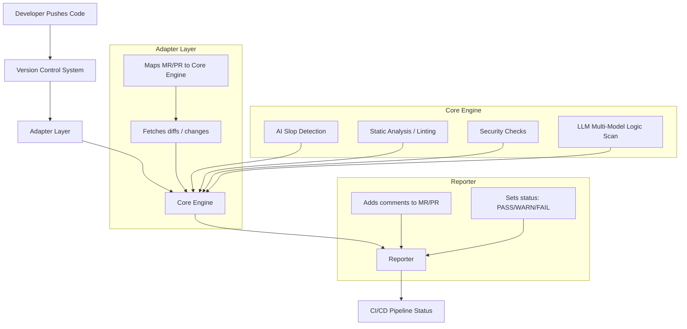

# 🛡️ ai-slop-gate

⚠️ **Status: Pre-Alpha / Experimental**

*ai-slop-gate is under active development. APIs, behavior, and policies may change without notice. Do NOT rely on this tool for production security decisions yet.*

---

**ai-slop-gate** is an open-source tool designed for automatic analysis of PRs/MRs to detect low-quality AI-generated code ("AI slop"), security vulnerabilities, and logic issues. It provides a vendor-agnostic way to maintain code quality in the age of AI-assisted development.

[](LICENSE)


## 🚀 Why AI-Slop-Gate?
The project was born from real-world developer pain: spending hours fixing integration tests broken by unverified, AI-generated JavaScript snippets pushed into shared repositories. 

In the era of LLMs, we need an automated "Quality Gate" that catches "AI slop" before it turns into expensive technical debt.

## 🎯 Project Goals
* **Detect AI Slop:** Identify messy, repetitive, or context-free code generated by AI models.
* **Hybrid Analysis:** Combine **Static Code Analysis** with deep **LLM insights** (via Groq, Gemini, or Copilot).
* **Shift-Left Review:** Allow developers to audit their code locally before pushing to the cloud.
* **Advisory Feedback:** Provide actionable insights for Team Leads and developers directly in the Pull Request.
* **Scalable Architecture:** Vendor-agnostic design supporting various AI models and CI/CD platforms.

## 🚫 Non-Goals (Important)

  ai-slop-gate is **NOT**:

- A replacement for human code reviews
- A formal security scanner or compliance certification tool
- A guarantee that AI-generated code is correct or safe
- A production-grade enforcement gate (yet)

The goal is **early signal, not absolute truth**.


## ✨ Features
- 🌍 **Vendor-agnostic:** Seamless integration with GitHub, GitLab, and Bitbucket.
- 🤖 **Multi-Model Intelligence:** Supports **Groq (Llama 3.3)** for extreme speed, **Google Gemini** (Free tier), **OpenRouter**, and native **GitHub Copilot** integration.
- ⚙️ **CI/CD Ready:** Automated PR commenting via GitHub API (GitHub Actions).
- 📢 **Advisory Mode:** Highlights issues without blocking workflows; critical issues can optionally fail the build.
- 🛠️ **Local CLI:** Developers can run audits on their machines using the same rules as the CI.


## 🛠️ Supported Languages & Infrastructure
* ✅ **Python** (Full support)
* ✅ **JavaScript / TypeScript** (Full support)
* 🚀 **Terraform & Kubernetes** (Active development - IaC review)
* 🔄 **Docker**

---

## 📂 Project Structure

AI-Slop-Gate is a polyglot project combining Python-based logic with industry-standard JavaScript linting rules.

```text
ai-slop-gate/
├── ai_slop_gate/           # Core Python Logic
│   ├── adapters/           # VCS Integrations (GitHub, etc.)
|   |── domain/             # Business Logic (Policy Engine, Decisions, Signals)
│   ├── reporters/          # PR Commenting & Reporting logic
│   ├── providers/          # AI Engines (Groq, Gemini, Copilot)
│   └── cli.py              # CLI Entry Point
├── rulesets/               # Static Analysis Rules
│   └── eslint/             # Pre-configured ESLint rules for JS safety
│       ├── base.mjs        # Standard coding patterns
│       ├── prod_safety.mjs # Production-ready checks
│       └── secrets.mjs     # Detection of leaked credentials
├── tests/                  # Integration and unit tests
├── .env.example            # Environment variables template
├── pyproject.toml          # Python build configuration
└── requirements.txt        # Python dependencies
```

## 🛡️ Polyglot Quality Control

Unlike simple AI wrappers, **ai-slop-gate** uses a multi-layered approach to ensure code integrity across different stacks:

* **Python Engine:** Orchestrates the analysis, manages CI/CD communication, and interfaces with high-speed LLMs.
* **JavaScript Rulesets:** Uses the `rulesets/eslint` directory to enforce strict production safety and prevent "AI-generated mess" in JS/TS files.
* **Static + AI:** By combining standard linting (ESLint) with AI logic, the tool catches both syntax errors and complex logical "slop".


## 🏗️ Architecture



---
## 🔐 Environment Variables

Create a `.env` file in the root directory of your project and add the keys for the providers you intend to use:

**Required for GitHub PR commenting**

`AI_SLOP_GATE_TOKEN`=your_github_personal_access_token

**Provider Keys (Add based on your configuration)**

`LLAMA_API_KEY`=your_openrouter_api_key

`GEMINI_API_KEY`=your_google_gemini_api_key

`SLOPE_GATE_GROQ`=your_groq_api_key


## 🧪 Getting Started (Early Preview)

### 1. Installation
```bash
git clone [https://github.com/SergUdo/ai-slop-gate.git](https://github.com/SergUdo/ai-slop-gate.git)
cd ai-slop-gate
pip install -e .
```

### 2. Initialize Configuration

Create your `.ai-slop-gate.yml` in seconds:

```
python -m ai_slop_gate.cli init
```
if you have `.ai-slop-gate.yml`  Use `--force` to overwrite

### 3. Local Usage
To run the analysis manually from your terminal, use the following command:

```
python -m ai_slop_gate.cli.main run --provider static --policy policy.yml
```

Optional arguments:

 - `k8s-manifests <path>` – path to Kubernetes YAML manifests

 - `github-checks` – report results as GitHub Checks

 - `github-repo <repo>` – repository name for GitHub reporting

 - `github-sha <sha>` – commit SHA for GitHub Checks

 - `pr-id <number>` – GitHub PR number to comment results

 - `enforcement <never|blocking|advisory>` – enforcement level (default: advisory)

### Run

```
python -m venv .venv
source .venv/bin/activate
pip install -e .
python src/cli.py --policy policy.yaml --mode advisory
```

#### Options Breakdown

* **`-policy`**: Path to your YAML configuration file (e.g., `policy.yml`).
* **`-provider`**: AI engine to use (groq, gemini, openrouter, or copilot).

### GitHub Actions Integration

When running in a CI/CD pipeline, you must add these variables to your **GitHub Repository Secrets**:

* **AI_SLOP_GATE_TOKEN**: (Mandatory) A GitHub token with permissions to read the PR diff and write comments.
* **Provider Keys**: `Add LLAMA_API_KEY`, `GEMINI_API_KEY`, or `SLOPE_GATE_GROQ` depending on which AI service your workflow is configured to use.

**Note**: Ensure your workflow file references these secrets accordingly.

## 📄 License
MIT License © 2025 Vira Udovychenko.

See the [MIT License](LICENSE) file for details.
