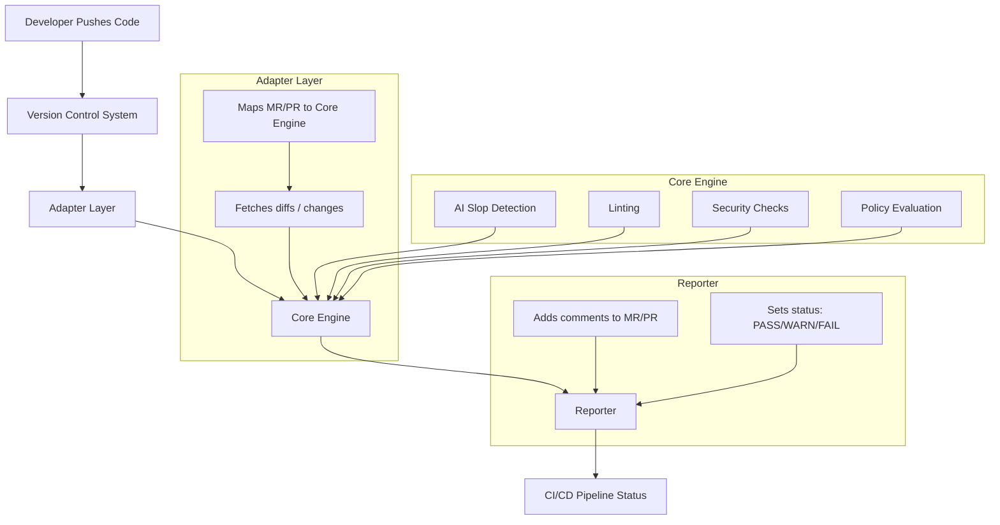

# 🛡️ ai-slop-gate

⚠️ **Status: Pre-Alpha / Experimental**

*ai-slop-gate is under active development. APIs, behavior, and policies may change without notice. Do NOT rely on this tool for production security decisions yet.*

---

**ai-slop-gate** is an open-source tool designed for automatic analysis of PRs/MRs to detect low-quality AI-generated code ("AI slop"), security vulnerabilities, and style issues. It provides a vendor-agnostic way to maintain code quality in the age of AI-assisted development.

## 🎯 Project Goals
* **Detect AI Slop:** Identify messy, repetitive, or context-free code generated by AI models.
* **Lint Configurations:** Validate Dockerfiles and other configuration files for best practices.
* **Security & Compliance:** Ensure code adheres to team security policies and standards.
* **Advisory Feedback:** Provide actionable insights for Team Leads and developers directly in the pipeline.
* **Scalable Architecture:** Vendor-agnostic design supporting various AI models and CI/CD platforms.

## 🚫 Non-Goals (Important)

  ai-slop-gate is **NOT**:

- A replacement for human code reviews
- A formal security scanner or compliance certification tool
- A guarantee that AI-generated code is correct or safe
- A production-grade enforcement gate (yet)

The goal is **early signal, not absolute truth**.

---

## ✨ Features
-   🌍 **Vendor-agnostic:** Seamless integration with GitHub, GitLab, and Bitbucket.
-   ⚙️ **CI-platform-agnostic:** Compatible with GitHub Actions, GitLab CI, Jenkins, and Bitbucket Pipelines.
-   🤖 **AI-powered:** Connects with various AI models for deep code quality analysis.
-   📢 **Advisory Mode:** Highlights issues without blocking workflows; critical issues can optionally fail the build.

---

## 🏗️ Architecture

## 🚀 Roadmap: Stage 1 (MVP)
* **CLI Tool:** Command-line interface to process MR/PR input locally or via adapters.
* **AI Slop Detection:** Core logic to identify low-quality AI-generated snippets.
* **Dockerfile Linting:** Built-in support for Docker configuration checks.
* **Basic Security:** Implementation of initial security policy rules.
* **Reporter:** Automated PR commenting and pipeline status management.
* **GitHub Adapter:** Ready-to-use integration for GitHub Pull Requests.

## 🧪 Getting Started (Early Preview)

	git clone git@github.com:SergUdo/ai-slop-gate.git
	cd ai-slop-gate
	npm install
	npm run dev

## 📄 License
MIT License © 2025 Vira Udovychenko.

See the LICENSE file for details.

