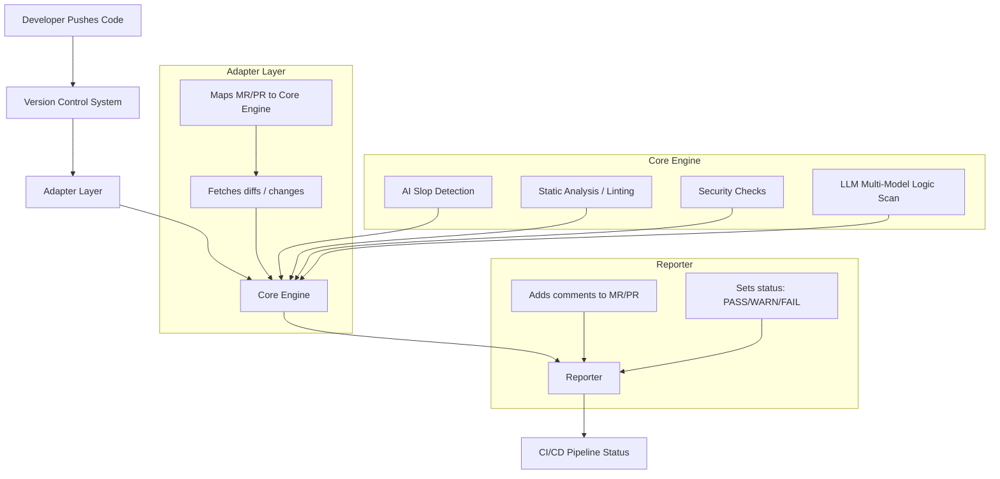

# 🛡️ ai-slop-gate

⚠️ **Status: Active Development (Beta)**


*ai-slop-gate is evolving rapidly. While we have implemented robust **DevSecOps gates** (SBOM, License Audit, CVE Scanning), the core AI reasoning logic and APIs are subject to change.*

---
**ai-slop-gate** — Open-source CI/CD tool combining static analysis and multi-LLM (Groq, Gemini, GitHub Copilot, OpenRouter) code review to detect low-intent AI-generated code.  
Implements deterministic normalization of LLM outputs (severity, confidence, signals) for audit-friendly automated quality gates.

### ✨ Key Features for Enterprise & EU-Regulated Teams

#### 🔐 Supply Chain Security  
- Detects forbidden licenses (GPL, AGPL)  
- Identifies AI-hallucinated or suspicious package names  
- Supports NIS2 and EU Cyber Resilience Act readiness  

#### 🇪🇺 GDPR/DSGVO Compliance  
- Enforces EU-only data residency for AI processing  
- Prevents non-compliant LLM routing  
- Produces audit-ready compliance reports  

#### 📝 Enterprise Policy-as-Code  
- Centralized `policy.yml` defining risk appetite  
- Deterministic evaluation for CI/CD  
- Consistent governance across teams and repositories

[](https://ai-slop-gate.readthedocs.io/en/latest/?badge=latest)
[](LICENSE)


## 📖 Documentation
Detailed documentation, including architecture description, provider settings, and audit examples, is available at the link:

👉 **[ai-slop-gate.readthedocs.io](https://ai-slop-gate.readthedocs.io/)**

## 🛡️ Security & Compliance

This project follows **DevSecOps** best practices to ensure the security of the tool and the code it analyzes:

* **Vulnerability Scanning:** Every build is automatically scanned by [Trivy](https://github.com/aquasecurity/trivy) for OS and dependency vulnerabilities. Results are available in the GitHub "Security" tab.
* **SBOM (Software Bill of Materials):** We generate a full SBOM in SPDX-JSON format using [Syft](https://github.com/anchore/syft) for every release. This ensures full transparency of all components used in the image.
**License Compliance:** Automated gates block restrictive licenses (e.g., AGPL) to protect intellectual property and ensure legal safety for enterprise use.
* **Data Sovereignty:** Support for local LLMs ensures that your source code never leaves your infrastructure, maintaining **GDPR** compliance.
* **Data Sovereignty:** Support for local LLMs (Mistral, DeepSeek) ensures that your source code never leaves your infrastructure, making it compliant with GDPR and internal corporate security policies.

* We take security seriously. Please refer to our [SECURITY.md](/docs/source/SECURITY.md) for information on:
* Automated security gates (Trivy, Syft, License Audit).
* Compliance with **EU AI Act** and **DORA** standards.

## 🎯 Project Goals
* **Detect AI Slop:** Identify messy, repetitive, or context-free code generated by AI models.
* **Hybrid Analysis:** Combine **Static Code Analysis** with deep **LLM insights** (via Groq, Gemini, or Copilot).
* **Shift-Left Review:** Allow developers to audit their code locally before pushing to the cloud.
* **Advisory Feedback:** Provide actionable insights for Team Leads and developers directly in the Pull Request.
* **Scalable Architecture:** Vendor-agnostic design supporting various AI models and CI/CD platforms.

## 🚫 Non-Goals (Important)

  ai-slop-gate is **NOT**:

- A replacement for human code reviews
- A formal security scanner or compliance certification tool
- A guarantee that AI-generated code is correct or safe
- A production-grade enforcement gate (yet)
- A disclaimer: AI Slop Gate is a technical security tool designed to support compliance workflows. Use of   this tool does not guarantee legal compliance with EU AI Act or DORA regulations. It should be used as part of a comprehensive compliance framework managed by legal and security professionals. 

The goal is **early signal, not absolute truth**.


## ✨ Features
- 🌍 **Vendor-agnostic:** Seamless integration with GitHub, GitLab.
- 🤖 **Multi-Model Intelligence:** Supports **Groq (Llama 3.3)** (Free tier) for extreme speed, **Google Gemini** (Free tier) and **Local LLMs (Ollama)** (Free tier) integration.
- 🇪🇺 **Regulatory Compliance (EU AI Act & DORA)**: Automated safeguards for AI robustness, accuracy, and cybersecurity (Article 15 AI Act) and digital operational resilience for financial sectors.
We provide a full SPDX SBOM for every release to comply with EU AI Act transparency requirements.
- ⚙️ **CI/CD Ready:** Automated PR commenting via GitHub API (GitHub Actions).
- 📢 **Advisory Mode:** Highlights issues without blocking workflows; critical issues can optionally fail the build.
- 🛠️ **Local CLI:** Developers can run audits on their machines using the same rules as the CI.
- 🛡️ **Supply Chain Security:** Detects forbidden licenses (GPL, AGPL) and AI-hallucinated package names.
- 🇪🇺 **GDPR/DSGVO Compliance:** Built-in checks for Data Residency to ensure AI processing stays within allowed regions (EU).
- 📝 **Enterprise Policy-as-Code:** Define your organization's risk appetite in a single `policy.yml`.


## ⚖️ Enterprise Compliance & Security (Deep Dive)

AI‑Slop‑Gate is designed with industrial standards in mind, with a strong focus on European regulatory requirements (GDPR/DSGVO, NIS2, CRA). 

### License Intelligence
Automatically analyzes code diffs and dependency metadata to detect high‑risk open‑source licenses that may introduce legal or IP contamination risks:
* **Forbidden:** GPL-2.0, GPL-3.0, AGPL-3.0.
* **Copy‑left Pattern Alerts**: Flags AI‑generated snippets that resemble GPL‑licensed code
* **Audit‑Ready Output**: Helps legal and compliance teams validate code provenance

### AI Hallucination Protection
Prevents supply‑chain attacks caused by LLM‑generated dependency names.
* Detects non‑existent, typosquatted, or malicious package names

* Warns when AI suggests dependencies outside your organization’s approved registry list

* Reduces risk of dependency spoofing in CI/CD pipelines

### GDPR/DSGVO Data Residency
Ensures that automated AI‑assisted code reviews comply with European data‑protection laws.

* Validates AI provider endpoints against EU‑only or EU‑approved regions

* Prevents accidental routing of code or metadata to non‑compliant LLM providers

* Produces compliance‑friendly logs suitable for internal audits

### Data Residency (GDPR/DSGVO)

AI Slop Gate includes a built‑in compliance check for data residency.

If `security_audit.enforce_data_residency` is set to `EU`, the tool will:

- warn when an LLM provider is located outside the EU
- continue execution (advisory mode)
- mark the final decision as ADVISORY

This allows using non‑EU LLMs (Gemini, Groq, Ollama)
while still surfacing GDPR‑related risks.

### For Developers:

* **Shift-Left Security**: Catch AI hallucinations and security vulnerabilities locally or during PR review—before they hit production.

* **No Vendor Lock-in**: Use any model provider or run everything locally via Ollama to keep your source code 100% private.

* **Transparent Rules**: No "black box" decisions. All checks are defined in your `policy.yml`.

* **Policy Override**: You can override the default policy file using the `--policy` flag. This is particularly useful for monorepos or different environment stages (e.g., `audit-only.yml` vs `strict-production.yml`):

```bash
# Run with a custom policy file
python -m ai_slop_gate.cli run --provider static --policy path/to/your-custom-policy.yml
```

## 🛠️ Supported Languages & Infrastructure
* ✅ **Python** (Full support)
* ✅ **JavaScript / TypeScript** (Full support)
* ✅ **Docker** (Full support)
* ✅ **Kubernetes** (Full support)
* 🚀 **Terraform** (Active development - IaC review)

---

## 📂 Project Structure

AI-Slop-Gate is a polyglot project combining Python-based logic with industry-standard JavaScript linting rules.

```text
ai-slop-gate/
├── ai_slop_gate/           # Core Python Logic
│   ├── __init__.py
│   ├── cli.py              # CLI Entry Point
│   ├── engine.py           # Core Engine Logic
│   ├── policy_legacy.py    # Legacy Policy Support
│   ├── result.py           # Result Data Models
│   ├── adapters/           # VCS Integrations (GitHub, GitLab, Bitbucket)
│   ├── cache/              # Caching Layer
│   ├── cli/                # CLI Module (subcommands)
│   ├── domain/             # Business Logic (Policy Engine, Decisions, Signals)
│   ├── engine/             # Engine Core Components
│   ├── fixtures/           # Test Fixtures & Sample Data
│   ├── github/             # GitHub-specific Integrations
│   ├── providers/          # AI Engines (Groq, Gemini, Copilot, OpenRouter)
│   ├── reporters/          # PR Commenting & Reporting logic
│   ├── rulesets/           # Rule Definitions & Loading
│   └── tests/              # Unit & Integration Tests
├── rulesets/               # Static Analysis Rules
│   └── eslint/             # Pre-configured ESLint rules for JS safety
│       ├── base.mjs        # Standard coding patterns
│       ├── prod_safety.mjs # Production-ready checks
│       └── secrets.mjs     # Detection of leaked credentials
├── scripts/                # Utility & Build Scripts
├── docs/                   # Documentation & Planning
├── Dockerfile              # Docker Container Definition
├── docker-compose.yml      # Docker Compose Configuration
├── pyproject.toml          # Python Build Configuration
├── requirements.txt        # Python Dependencies
├── eslint.config.js        # ESLint Configuration
├── pytest.ini              # pytest Configuration
├── policy.yml              # Default Policy Configuration
├── .env.example            # Environment Variables Template
├── ARCHITECTURE.md         # Architecture Documentation
├── CONTRIBUTING.md         # Contribution Guidelines
├── DEV_SETUP.md            # Development Setup Guide
└── LICENSE                 # MIT License
```

## 🏗️ Architecture



---
## 🔐 Environment Variables

Create a `.env` file in the root directory of your project and add the keys for the providers you intend to use:

**Required for GitHub PR commenting**

`GITHUB_TOKEN`=your_github_personal_access_token

**Provider Keys (Add based on your configuration)**

`GEMINI_API_KEY`=your_google_gemini_api_key

`SLOPE_GATE_GROQ`=your_groq_api_key


## 🧪 Getting Started (Early Preview)

### 1. Installation
```bash
git clone [https://github.com/SergUdo/ai-slop-gate.git](https://github.com/SergUdo/ai-slop-gate.git)
cd ai-slop-gate
python -m venv .venv
source .venv/bin/activate
pip install -e .
```

### 2. Initialize Configuration

Create your `.ai-slop-gate.yml` in seconds:

```bash
python -m ai_slop_gate.cli init
```
if you have `.ai-slop-gate.yml`  Use `--force` to overwrite

### 3. Local Usage

Analyze the current project (ai‑slop‑gate itself)
When you run the CLI inside the ai‑slop‑gate repository, the tool analyzes its own source code by default:

```bash
python -m ai_slop_gate.cli.main run --provider static --policy policy.yml
```
#### Analyze any external repository

```bash
python -m ai_slop_gate.cli run --provider static --policy policy.yml --path /path/to/your/project
```

```bash
 python -m ai_slop_gate.cli run --compliance --policy policy.yml --path /path/to/your/project
```

#### Run LLM locally:

```bash
python -m ai_slop_gate.cli.main run --provider gemini --llm-local --policy policy.yml --path /path/to/your/project
```

```bash
python -m ai_slop_gate.cli.main run --provider groq --llm-local --policy policy.yml --path /path/to/your/project
```

#### Supported Providers
- `static` — full static analysis (secrets, eval, Dockerfile, PII, TODO, supply‑chain)

- `groq` — LLM analysis (local or GitHub PR)

- `gemini` — LLM analysis (local or GitHub PR)

- `compliance` — GDPR, EU residency, license, supply‑chain compliance

#### Optional arguments

- `--provider <name>`  
  Provider to run (static, gemini, groq, openrouter, copilot, local).

- `--llm-local`  
  Run Groq/Gemini on the local project (full‑repo LLM mode)

- `--github-repo <owner/repo>`  
  Enable GitHub integration.

- `--pr-id <number>`  
  Analyze a GitHub Pull Request (LLM diff‑only mode).

- `--github-sha <sha>`  
  Report results as GitHub Checks.

- `--enforcement <never|blocking|advisory>`  
  Override global enforcement mode.

- `--profile <name>`  
  Select compliance profile from policy.yml.

- `--verbose`  
  Show full diagnostic output.

#### ⚠️ API_KEY and Token Required

LLM providers (Groq, Gemini) require a `API_KEY` when analyzing.
If no `GITHUB_TOKEN` and `API_KEY` is provided, the CLI will skip the LLM provider and fall back to non‑LLM checks.

When no token is available, you will see:

```bash
Skipping LLM provider 'gemini': insufficient context.
```

### Running Tests

```bash
python -m pytest ai_slop_gate/tests -v
```

or:

```bash
source .venv/bin/activate
python -m pytest ai_slop_gate/tests --cov=ai_slop_gate --cov-report=term-missing --cov-report=html
```

Open the generated HTML coverage report:

```bash
xdg-open htmlcov/index.html  # or open in your browser
```

If you want, I can generate a prioritized list of files to add focused tests for to raise coverage further.

### 🔍 Analysis Examples & Reports
You can find real-world execution logs in the docs/ folder:

➡️ **[LLM Analysis (Gemini)](docs/answer_gemini.txt)** - Detection of AI slop, hallucinations, and overengineered patterns using Gemini.

➡️ **[LLM Analysis (Groq)](docs/answer_groq.txt)** - Detection of AI slop, hallucinations, and overengineered patterns using GROQ.

➡️ **[Statics Audit](docs/answer_static_pipelane.txt)** — High-speed, deterministic security & quality gates for polyglot environments:

- **Multi-Language Support**: Built-in static providers for `Python (AST)`, `JavaScript/TypeScript (ESLint)`.

- **Infrastructure as Code (IaC)**: Deep inspection of `Kubernetes (static & runtime)`, `Terraform (static & plan)`, and `Dockerfiles` to prevent misconfigurations.

- **Supply Chain Security**: Validation of dependency manifests and registry integrity to block malicious or high-risk packages.

- **Zero-Cost Pre-filtering**: Instant detection of hardcoded secrets, dangerous functions (eval, exec), and permissive permissions before invoking LLM engines.

➡️ **[Compliance Audit](docs//answer_complaince.txt)** - Automated gate for legal and regulatory requirements:

- **License Intelligence**: Real-time detection of forbidden licenses (GPL/AGPL) and copy-left pattern alerts to prevent IP contamination.

- **AI Hallucination Protection**: Prevention of supply-chain attacks by detecting non-existent or typosquatted package names suggested by LLMs.

- **GDPR/DSGVO Residency**: Strict validation of AI provider regions to ensure code and metadata stay within EU-approved endpoints.

## 🧪 Test Your Workflow

To see `ai-slop-gate` in action, we maintain a dedicated repository filled with "AI Slop", insecure code patterns, and various violations:

👉 **[SergUdo/slop_test](https://github.com/SergUdo/slop_test)**

You can use this repository to:
- **Benchmark** the detection engine.
- **Test** your CI/CD integration.
- **Verify** how the tool handles different levels of "slop" and policy violations.

### 🐳 Docker Support

ai‑slop‑gate can be executed inside Docker for reproducible CI/CD runs.

#### Prerequisites

- Docker installed.

#### 📦 Pull Pre‑built Image

```bash
docker pull ghcr.io/sergudo/ai-slop-gate:latest
```

#### 🐳 Running with Docker

```bash
docker run --rm -v $(pwd):/src ghcr.io/sergudo/ai-slop-gate:latest \
  run --provider static \
  --policy /src/policy.yml \
  --path /src
```

**Breakdown of arguments:**

- `-v $(pwd):/src`: Mounts your current directory (containing your code and `policy.yml`) to the `/src` folder inside the container.

- `--rm`: Automatically removes the container after the analysis is finished.

- `--policy /src/policy.yml`: Path to your policy file inside the container.

`--path /src`: The directory to analyze (in this case, everything you mounted).

**Note**: Ensure your `policy.yml` is present in the directory where you run this command, or adjust the path accordingly.


#### 🛠️ Build & Run Locally

**Build the image**:

```bash
docker build -t ai-slop-gate .
```

**Run the local image**:

```bash
docker run --rm \
  -v $(pwd):/data \
  ai-slop-gate \
  run --provider static --policy /data/policy.yml --path /data
```

### 🐳 Running with Local LLM (Docker & Ollama)

AI Slop Gate is fully containerized and can run with local LLMs (via Ollama) to ensure 100% data privacy and zero API costs.

* **Infrastructure Setup**

The easiest way to start is using the provided `docker-compose.yml`. This will spin up the Gate and an Ollama instance:

```bash
# Start the local AI infrastructure
docker-compose up -d
```

* **Local CLI Execution**

If you want to run the analysis against a local project directory using the containerized engine:

```bash
python -m ai_slop_gate.cli run \
  --provider ollama \
  --llm-local \
  --path ./your-project \
  --policy policy.yml
```

* **CI/CD Integration (GitHub Actions / Self-Hosted)**

To use local LLM in your CI pipeline on a self-hosted runner:

- **Deploy the stack on your runner**: `docker-compose up -d`.
- **Execute via Action**: Trigger the analysis by mounting the workspace into the container:

```bash
- name: Run AI Slop Gate
  run: |
    docker compose run --rm gate \
      python -m ai_slop_gate.cli run \
      --provider ollama \
      --llm-local \
      --path /workspace/your-project
```

### GitHub Actions Integration

When running in a CI/CD pipeline, you must add these variables to your **GitHub Repository Secrets**:

* **GITHUB_TOKEN**: (Mandatory) A GitHub token with permissions to read the PR diff and write comments.
* **Provider Keys**: `GEMINI_API_KEY`, or `SLOPE_GATE_GROQ` depending on which AI service your workflow is configured to use.

#### Examples workflows

➡️ **[docs/workflow_gemini.yml](docs/example_workflow_gemini.yml)**

➡️ **[docs/workflow_static.yml](docs/example_workflow_static.yml)**

**Note**: Ensure your workflow file references these secrets accordingly.

### GitLab Integration

AI Slop Gate supports full GitLab CI/CD integration, including static, LLM, and compliance analysis.

See the full guide here:

➡️ **[docs/gitlab.md](docs/gitlab.md)**

This document explains:
- how to configure `.gitlab-ci.yml`
- how to run static, LLM, and full analysis
- how to set GitLab CI/CD variables
- how to use Groq and Gemini inside private GitLab repositories


## 📄 License
MIT License © 2025 Vira Udovychenko.

See the [MIT License](LICENSE) file for details.
