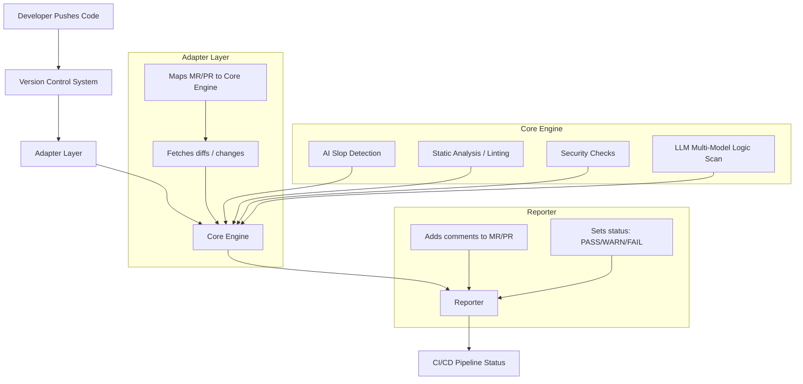

# 🛡️ ai-slop-gate

⚠️ **Status: Pre-Alpha / Experimental**

*ai-slop-gate is under active development. APIs, behavior, and policies may change without notice. Do NOT rely on this tool for production security decisions yet.*

---
**ai-slop-gate** — Open-source CI/CD tool combining static analysis and multi-LLM (Groq, Gemini, GitHub Copilot, OpenRouter) code review to detect low-intent AI-generated code.  
Implements deterministic normalization of LLM outputs (severity, confidence, signals) for audit-friendly automated quality gates.

### ✨ Key Features for Enterprise & EU-Regulated Teams

#### 🔐 Supply Chain Security  
- Detects forbidden licenses (GPL, AGPL)  
- Identifies AI-hallucinated or suspicious package names  
- Supports NIS2 and EU Cyber Resilience Act readiness  

#### 🇪🇺 GDPR/DSGVO Compliance  
- Enforces EU-only data residency for AI processing  
- Prevents non-compliant LLM routing  
- Produces audit-ready compliance reports  

#### 📝 Enterprise Policy-as-Code  
- Centralized `policy.yml` defining risk appetite  
- Deterministic evaluation for CI/CD  
- Consistent governance across teams and repositories  


[](LICENSE)


## 🎯 Project Goals
* **Detect AI Slop:** Identify messy, repetitive, or context-free code generated by AI models.
* **Hybrid Analysis:** Combine **Static Code Analysis** with deep **LLM insights** (via Groq, Gemini, or Copilot).
* **Shift-Left Review:** Allow developers to audit their code locally before pushing to the cloud.
* **Advisory Feedback:** Provide actionable insights for Team Leads and developers directly in the Pull Request.
* **Scalable Architecture:** Vendor-agnostic design supporting various AI models and CI/CD platforms.

## 🚫 Non-Goals (Important)

  ai-slop-gate is **NOT**:

- A replacement for human code reviews
- A formal security scanner or compliance certification tool
- A guarantee that AI-generated code is correct or safe
- A production-grade enforcement gate (yet)

The goal is **early signal, not absolute truth**.


## ✨ Features
- 🌍 **Vendor-agnostic:** Seamless integration with GitHub, GitLab, and Bitbucket.
- 🤖 **Multi-Model Intelligence:** Supports **Groq (Llama 3.3)** for extreme speed, **Google Gemini** (Free tier), **OpenRouter**, and native **GitHub Copilot** integration.
- ⚙️ **CI/CD Ready:** Automated PR commenting via GitHub API (GitHub Actions).
- 📢 **Advisory Mode:** Highlights issues without blocking workflows; critical issues can optionally fail the build.
- 🛠️ **Local CLI:** Developers can run audits on their machines using the same rules as the CI.
- 🛡️ **Supply Chain Security:** Detects forbidden licenses (GPL, AGPL) and AI-hallucinated package names.
- 🇪🇺 **GDPR/DSGVO Compliance:** Built-in checks for Data Residency to ensure AI processing stays within allowed regions (EU).
- 📝 **Enterprise Policy-as-Code:** Define your organization's risk appetite in a single `policy.yml`.


## ⚖️ Enterprise Compliance & Security (Deep Dive)

AI‑Slop‑Gate is designed with industrial standards in mind, with a strong focus on European regulatory requirements (GDPR/DSGVO, NIS2, CRA). 

### License Intelligence
Automatically analyzes code diffs and dependency metadata to detect high‑risk open‑source licenses that may introduce legal or IP contamination risks:
* **Forbidden:** GPL-2.0, GPL-3.0, AGPL-3.0.
* **Copy‑left Pattern Alerts**: Flags AI‑generated snippets that resemble GPL‑licensed code
* **Audit‑Ready Output**: Helps legal and compliance teams validate code provenance

### AI Hallucination Protection
Prevents supply‑chain attacks caused by LLM‑generated dependency names.
* Detects non‑existent, typosquatted, or malicious package names

* Warns when AI suggests dependencies outside your organization’s approved registry list

* Reduces risk of dependency spoofing in CI/CD pipelines

### GDPR/DSGVO Data Residency
Ensures that automated AI‑assisted code reviews comply with European data‑protection laws.

* Validates AI provider endpoints against EU‑only or EU‑approved regions

* Prevents accidental routing of code or metadata to non‑compliant LLM providers

* Produces compliance‑friendly logs suitable for internal audits

## 🛠️ Supported Languages & Infrastructure
* ✅ **Python** (Full support)
* ✅ **JavaScript / TypeScript** (Full support)
* 🚀 **Terraform & Kubernetes** (Active development - IaC review)
* 🔄 **Docker**

---

## 📂 Project Structure

AI-Slop-Gate is a polyglot project combining Python-based logic with industry-standard JavaScript linting rules.

```text
ai-slop-gate/
├── ai_slop_gate/           # Core Python Logic
│   ├── adapters/           # VCS Integrations (GitHub, etc.)
|   |── domain/             # Business Logic (Policy Engine, Decisions, Signals)
│   ├── reporters/          # PR Commenting & Reporting logic
│   ├── providers/          # AI Engines (Groq, Gemini, Copilot)
│   └── cli.py              # CLI Entry Point
├── rulesets/               # Static Analysis Rules
│   └── eslint/             # Pre-configured ESLint rules for JS safety
│       ├── base.mjs        # Standard coding patterns
│       ├── prod_safety.mjs # Production-ready checks
│       └── secrets.mjs     # Detection of leaked credentials
├── tests/                  # Integration and unit tests
├── .env.example            # Environment variables template
├── pyproject.toml          # Python build configuration
└── requirements.txt        # Python dependencies
```

## 🛡️ Polyglot Quality Control

Unlike simple AI wrappers, **ai-slop-gate** uses a multi-layered approach to ensure code integrity across different stacks:

* **Python Engine:** Orchestrates the analysis, manages CI/CD communication, and interfaces with high-speed LLMs.
* **JavaScript Rulesets:** Uses the `rulesets/eslint` directory to enforce strict production safety and prevent "AI-generated mess" in JS/TS files.
* **Static + AI:** By combining standard linting (ESLint) with AI logic, the tool catches both syntax errors and complex logical "slop".


## 🏗️ Architecture



---
## 🔐 Environment Variables

Create a `.env` file in the root directory of your project and add the keys for the providers you intend to use:

**Required for GitHub PR commenting**

`AI_SLOP_GATE_TOKEN`=your_github_personal_access_token

**Provider Keys (Add based on your configuration)**

`LLAMA_API_KEY`=your_openrouter_api_key

`GEMINI_API_KEY`=your_google_gemini_api_key

`SLOPE_GATE_GROQ`=your_groq_api_key


## 🧪 Getting Started (Early Preview)

### 1. Installation
```bash
git clone [https://github.com/SergUdo/ai-slop-gate.git](https://github.com/SergUdo/ai-slop-gate.git)
cd ai-slop-gate
pip install -e .
```

### 2. Initialize Configuration

Create your `.ai-slop-gate.yml` in seconds:

```
python -m ai_slop_gate.cli init
```
if you have `.ai-slop-gate.yml`  Use `--force` to overwrite

### 3. Local Usage

To run the analysis manually from your terminal:

    python -m ai_slop_gate.cli.main run --provider static --policy policy.yml

#### Optional arguments

- `--input-file <path>`  
  Path to the input file for the selected provider (e.g. requirements.txt).

- `--k8s-manifests <path>`  
  Path to Kubernetes YAML manifests.

- `--github-checks`  
  Report results as GitHub Checks.

- `--github-repo <repo>`  
  Repository name for GitHub reporting.

- `--github-sha <sha>`  
  Commit SHA for GitHub Checks.

- `--pr-id <number>`  
  GitHub PR number to comment results.

- `--enforcement <never|blocking|advisory>`  
  Override enforcement level (default: advisory).

- `--compliance`  
  Force run compliance audit (license checks, secret scanning, residency checks).

- `--profile <name>`  
  Override active compliance profile defined in policy.yml.

- `--verbose`  
  Enable full verbose mode, including:
  - `active profile`
  - `merged compliance settings`
  - `loaded rules`
  - `observations with evidence`
  - `policy reasons`
  - `annotations`
  - `final decision summary`


#### Examples

Run static analysis with default settings:

    python -m ai_slop_gate.cli.main run --provider static --policy policy.yml

Run with verbose output:

    python -m ai_slop_gate.cli.main run --provider static --policy policy.yml --verbose

Run with a specific compliance profile:

    python -m ai_slop_gate.cli.main run --provider static --policy policy.yml --profile eu-strict


### Run

```
python -m venv .venv
source .venv/bin/activate
pip install -e .
python src/cli.py --policy policy.yaml --mode advisory
```

#### Options Breakdown

* **`-policy`**: Path to your YAML configuration file (e.g., `policy.yml`).
* **`-provider`**: AI engine to use (groq, gemini, openrouter, or copilot).

### Running Tests

To run all tests with verbose output:

```bash
# From the project root
python -m pytest ai_slop_gate/tests -v

# or if using virtual environment
source .venv/bin/activate
python -m pytest ai_slop_gate/tests -v
```

### 🐳 Docker Support

**ai-slop-gate** can be run as a Docker container for easy deployment and integration into CI/CD pipelines.

#### Prerequisites
- Docker installed on your system.

#### 📦 Docker Image

A pre-built Docker image is available:

```bash
  docker pull sergiudo/ai-slop-gate:latest
```

or

Local use:
```bash
docker build -t ai-slop-gate .
```

#### Minimal Run
```bash
  docker run --rm sergiudo/ai-slop-gate:latest \
    run --provider static --policy /data/policy.yml
```

#### Mount Your Project
```bash
  docker run --rm \
    -v $(pwd):/data \
    sergiudo/ai-slop-gate:latest \
    run --provider static --policy /data/policy.yml
```

#### Environment Variables (AI Providers)
```bash
  docker run --rm \
    -e GEMINI_API_KEY=$GEMINI_API_KEY \
    -e AI_SLOP_GATE_TOKEN=$AI_SLOP_GATE_TOKEN \
    -v $(pwd):/data \
    sergiudo/ai-slop-gate:latest \
    run --provider gemini --policy /data/policy.yml
```

#### CI/CD Example (GitHub Actions)
```bash
  steps:
  - uses: actions/checkout@v4
  - name: Run ai-slop-gate
    run: |
      docker run --rm \
        -e GEMINI_API_KEY=${{ secrets.GEMINI_API_KEY }} \
        -e AI_SLOP_GATE_TOKEN=${{ secrets.AI_SLOP_GATE_TOKEN }} \
        -v ${{ github.workspace }}:/data \
        sergiudo/ai-slop-gate:latest \
        run --provider gemini --policy /data/policy.yml --github-checks
```


### GitHub Actions Integration

When running in a CI/CD pipeline, you must add these variables to your **GitHub Repository Secrets**:

* **AI_SLOP_GATE_TOKEN**: (Mandatory) A GitHub token with permissions to read the PR diff and write comments.
* **Provider Keys**: `Add LLAMA_API_KEY`, `GEMINI_API_KEY`, or `SLOPE_GATE_GROQ` depending on which AI service your workflow is configured to use.

**Note**: Ensure your workflow file references these secrets accordingly.

## 📄 License
MIT License © 2025 Vira Udovychenko.

See the [MIT License](LICENSE) file for details.
